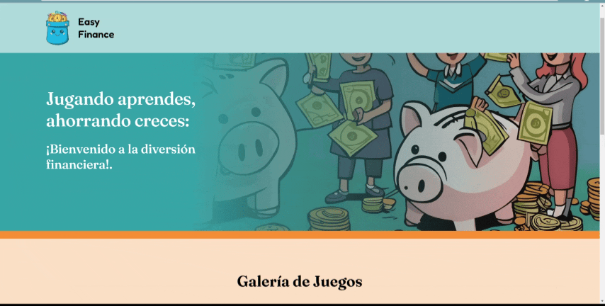

<div align="center">
  
</div>

<h1 align="center">Easy Finance</h1>
<h3 align="center">(Project in Progress)</h3>
<br>


# 📄 Description
This project aims to teach Financial Education to elementary school children using Gamification as the primary teaching and learning method. The goal is to introduce fundamental financial concepts such as:

- Personal Budget
- Saving
- Spending
- Expenses
- Needs
- Debt

<br>

All of this by integrating game mechanics such as rewards, decision-making challenges, and point systems. This approach helps children develop practical financial skills in a fun, interactive environment. 
Gamification allows them to explore real-life financial scenarios safely, encouraging better knowledge retention and promoting healthy financial habits from an early age.

<br>

> [!NOTE]
> This software project comes from a scholar thesis project whose title is: <br> <b>"Learning Financial Education in Primary School Students at the Néstor Forero Alcalá School Through Gamification". </b>

<br>

# 🖥 Preview
<br>


<br>

# ⛏ Installation
1. Clone the repository:
   ```bash
   git clone https://github.com/FazeElian/thesis_pj-easy_finance.git
   ```

<br>

2. Install dependencies:
   ```bash
   npm install
   ```

<br>

3. Start server
   ```bash
   npm start
   ```

<br>
   
# 🎨 Design
For the creation of the User Interfaces (UI) design, we decided to use Figma as the mockups - wireframes tool.
<br>
  
Watch the Design clicking [here](https://www.figma.com/design/CTXPtMhAAElkN8S6jGoe0n/Easy-Finance-mockup?node-id=0-1&t=vnCpLLRO4vL0MxiD-1)

<br>

# 🚀 Contributing

Pull requests are welcome. For major changes, please open an issue first
to discuss what you would like to change.

<br>

# ⚙ Building
This site was built using [Netlify](https://www.netlify.com/).
